# Using sleuthkit and libewf to identify partitions and extract deleted files on an evidence E01 disk

Sleuthkit and Libewf can be used on Ubuntu to recover deleted files from multiple types of partitions on a disk. The following example was created using a virtual hard drive created on Windows 10 with a NTFS and FAT32 partition. Both partitions will be mounted and file recovery tools are used in a similar manner against each filesystem.

## Installing ewf-tools and sleuthkit

These tools can be installed with the following command in Ubuntu:

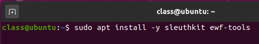

## Mounting E01 file

Create a mount point for the evidence disk:

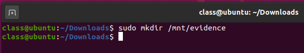

Now, run `ewfmount`, being sure to specify the source image and mount point as specified above:

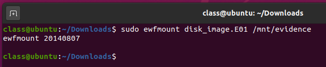

## Mounting the NTFS partition of the E01 file

Run `mmls` to list out the mounted image's partitions:

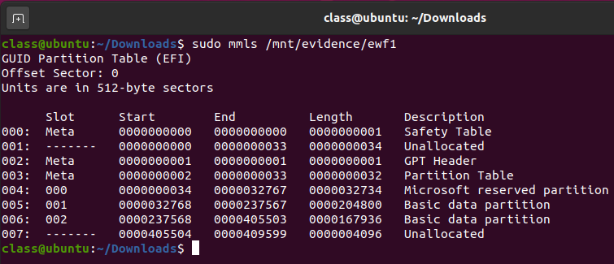

Create mountpoints for the partitions that will be mounted:

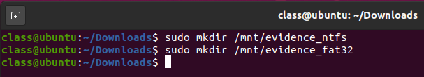

Now, run the following command to mount the partition:

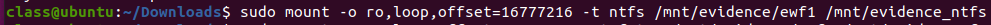

Since the sector size is 512 bytes per sector, take the **Start** location that was listed from the `mmls` command and multiply it by 512. This will be the number that must be used in the mounting command. The specified mount point should now have the file system accessible. 

## Running fsstat to get partition metadata

Now, run `lsblk` to find the device that aligns with the mount point:

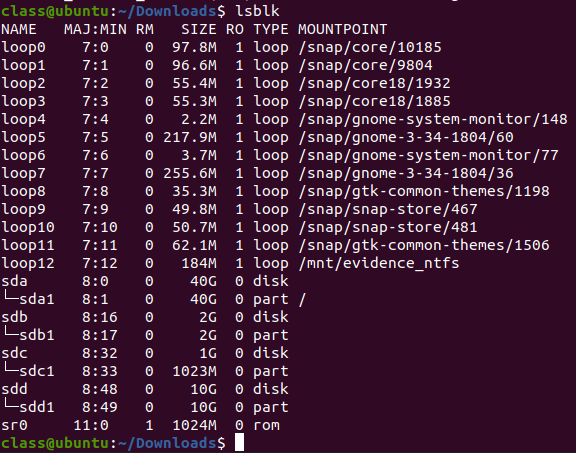

Using this information (in this case the device is `loop12`), prepend `dev/` to the device name and run fsstat on the partition:

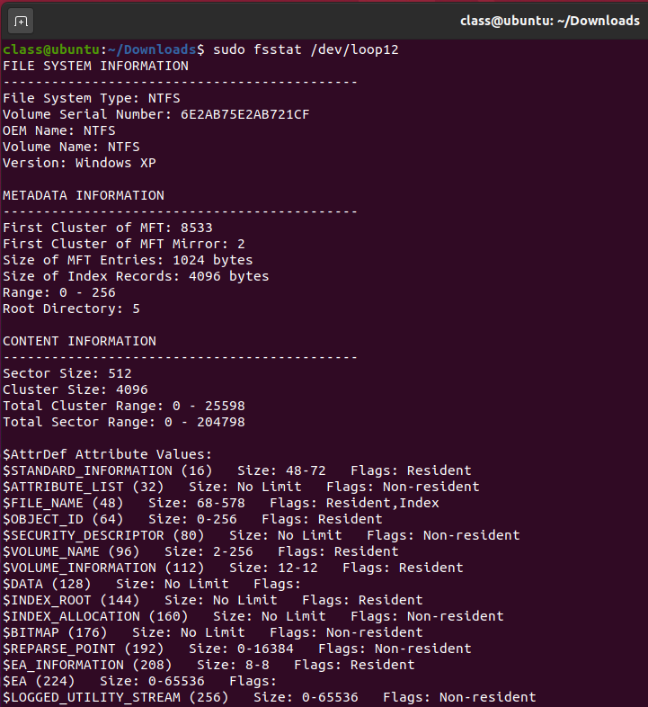

This shows the partition's file system metadata.

## Running fls to identify deleted files on a partition

Now, the `fls` command can be used to list out the deleted files on the partition by referencing the same device structure as before:

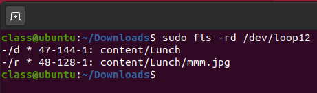

The `-rd` flags specify to only show deleted items and to recursively search for them.

## Recovering deleted files from an NTFS partition

To recover deleted files on the NTFS partition, run `tsk_recover` against the same device that was used for mounting. This will recover deleted files and place them in a specified recovery directory:

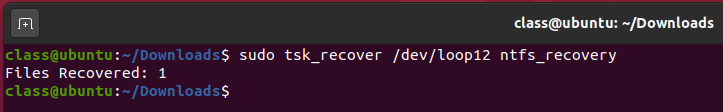

The recovered data will be present in the directory previously specified:

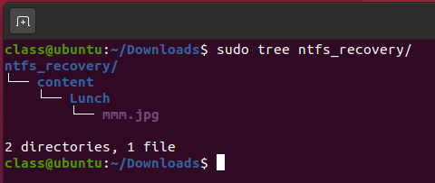

## Mounting the FAT32 Partition of the E01 File

Similarly, the same process was followed after unmounting the first NTFS partition for the FAT32 partition. Use the same method described above to calculate the exact offset to use from information provided in the `mmls` command:

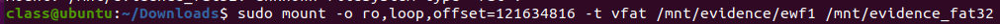

## Running fsstat to get partition metadata

Again, run `lsblk` to find the aligning device for the mount point:

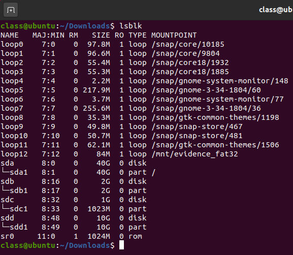

Using this device, run `fsstat` to get filesystem metadata:

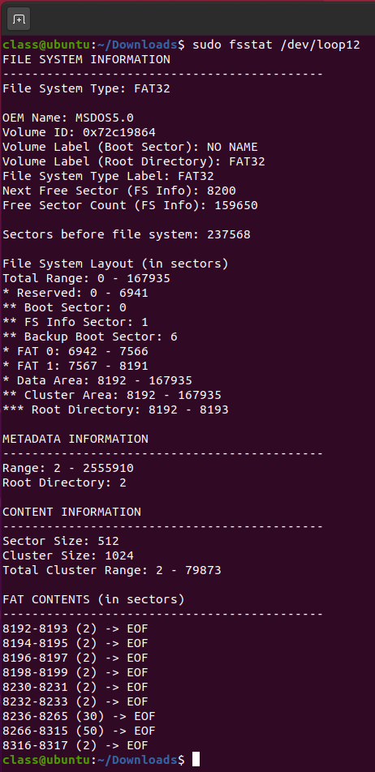

## Running fls to identify deleted files on a partition

Again, the `fls` command can be used to list out deleted files on the partition by device as before:

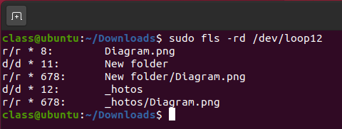

The `-rd` flags specify to only show deleted items and to recursively search for them.

## Recovering deleted files from a FAT32 partition

Again, run `tsk_recover` against the mounting device to recover deleted items:

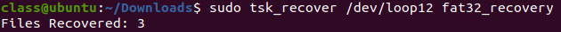

The recovered items will be present in the previously chosen directory:

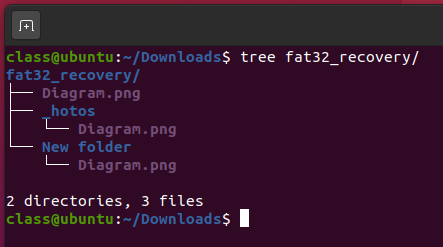